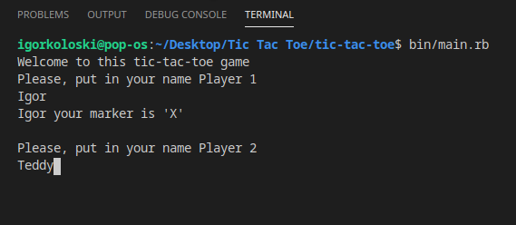
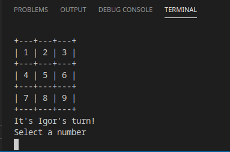
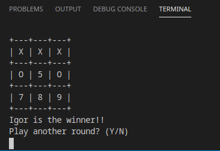

# Tic-tac-toe

> This project is a tic-tac-toe game that we made and can be played in a console

This is our 3rd ruby project in microverse

## Built With

- Ruby

### Prerequisites

For local usage, ensure you have Ruby installed

## Getting Started

### To get a local copy up and running simply follow the next step.

- Clone this repository on to your local PC
  - Click on the `Code` green button
  - By the right end of the read-only input containing the repository link click the clipboard icon to copy the link
  - In your local PC, open your terminal in the folder you would like to clone the repository into
  - Clone the repository with the command: `git clone (copied link)`; like so: `git clone https://github.com/TedLivist/tic-tac-toe.git`
- After the clone, and still on the terminal, type in the command `cd tic-tac-toe` to access the cloned directory
- On the terminal, type `bin/main.rb` to start the game
- Most important. Have fun!

### Game Rules

After cloning the repo and accessing the `tic-tac-toe` directory on the terminal, as described above:

  1. To continue the game you must choose a nickname!
  2. Each player gets a sign to use during the game. Its either X or O
  3. The game is played in turns. Each player gets one turn
  4. The goal is for each player to get 3 of the same sign on a same line (row, column or diagonal)
  5. The first player to get 3 in a line WINS!!!
  6. If the board is full and neither player got 3 in a line game ends in a draw.

## Setup test

### To setup the Rspec testing process
 
 - While in the directory on the terminal run `bundle install`
 - To install `rspec` gem run `gem install rspec` on the terminal
 - Finally, to run the tests type `rspec spec/[test_file.rb]` like so `rspec spec/logic_spec.rb` to run test on the `Logic` class

## Authors

:bust_in_silhouette: **Igor Koloski**

- GitHub: [@igorkol91](https://github.com/igorkol91)
- Twitter: [@Destro49536502](https://twitter.com/Destro49536502)
- LinkedIn: [LinkedIn](https://www.linkedin.com/in/igor-koloski-a754aa208/)

:bust_in_silhouette: **Teddy-Livingstone Ememandu**

- [GitHub](https://github.com/TedLivist)
- [Twitter](https://twitter/iamxted)
- [LinkedIn](https://linkedin.com/in/tememandu)

## :handshake: Contributing

Contributions, issues, and feature requests are welcome!
Feel free to contribute

## Show your support

Give a ⭐️ if you like this project!
